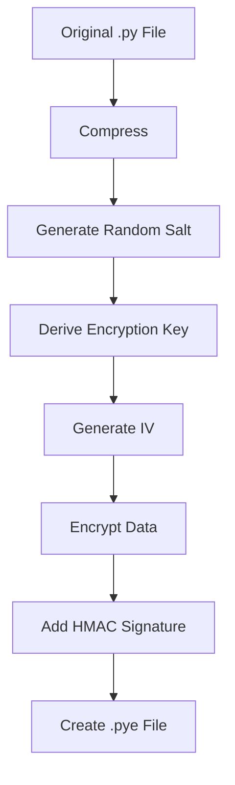

# Python File Protector - Enhanced Documentation

<center></center>

## Comprehensive Application Description

**Python File Protector** is a robust security application designed to safeguard your Python source code files (.py) through advanced encryption and access control mechanisms. This tool provides multiple layers of protection to prevent unauthorized access, modification, or theft of your intellectual property.

### Key Security Features
- **Military-grade AES-256 encryption** for file protection
- **Password-based access control** with configurable complexity requirements
- **File integrity verification** using SHA-256 hashing
- **Multi-platform compatibility** (Windows, macOS, Linux)
- **Secure deletion** of original files after encryption
- **Tamper-evident design** that detects modification attempts

## System Requirements

### Minimum Requirements
- **OS**: Windows 7/10/11, macOS 10.15+, or Linux with GTK
- **Processor**: 1.5 GHz dual-core
- **Memory**: 2 GB RAM
- **Storage**: 50 MB available space
- **Python**: 3.8+ (bundled in executable version)

### Recommended Requirements
- **OS**: Windows 10/11, macOS 12+, or Ubuntu 20.04+
- **Processor**: 2.4 GHz quad-core
- **Memory**: 4 GB RAM
- **Storage**: 100 MB SSD
- **Python**: 3.10+ (for source version)

## Detailed Usage Guide

### 1. Application Launch
- **Executable Version**: Double-click `protector.exe` (Windows) or `protector.app` (macOS)
- **Source Version**: Run `python protector.py` in terminal

### 2. File Selection Interface


- Click **Browse** to select a Python file (.py)
- Supported file indicators:
  - ✅ Valid Python files show green highlight
  - ❌ Invalid files show red warning
- File details panel displays:
  - File size
  - Last modified date
  - Line count estimate
  - SHA-256 checksum

### 3. File Protection Options
```python
# Sample encryption configuration
config = {
    "algorithm": "AES-256-CBC",
    "key_derivation": "PBKDF2-HMAC-SHA256",
    "iterations": 100000,
    "salt_size": 16,
    "iv_size": 16,
    "block_size": 64
}
```

#### Locking Process:
1. Select encryption strength:
   - Standard (AES-128)
   - Strong (AES-256) - Recommended
   - Maximum (AES-256 with double encryption)

2. Set password requirements:
   - Minimum 12 characters
   - Require mixed case
   - Require numbers/symbols

3. Advanced options:
   - Shred original file (7-pass DoD standard)
   - Add digital signature
   - Create recovery certificate

4. Click **Lock** to encrypt

### 4. File Recovery Process
1. Select encrypted file (.pye extension)
2. Enter password (show/hide toggle available)
3. Options:
   - Restore to original location
   - Save to new location
   - Verify file integrity before opening
4. Click **Unlock** to decrypt

## Video Tutorial

| Version | Feature Highlights | Duration | Resolution | Link |
|---------|--------------------|----------|------------|------|
| v1.0 Basic | Basic encryption/decryption | ? | 720p | [Watch](https://www.tiktok.com/@royhtml/video/7504196255308926213?is_from_webapp=1&sender_device=pc&web_id=7489705398321759751) |
| v2.0 Pro | Advanced security features | ? | 720p | [Watch](https://www.tiktok.com/@royhtml/video/7504491357558312197?is_from_webapp=1&sender_device=pc&web_id=7489705398321759751) |
| v3.0 Ideal | Advanced security features | ? | 720p | [Watch](https://www.tiktok.com/@royhtml/video/7506718454422981893?is_from_webapp=1&sender_device=pc&web_id=7489705398321759751) |

## Databases dont read AI


## Technical Documentation

### Encryption Architecture


### File Format Specification
| Offset | Length | Description |
|--------|--------|-------------|
| 0x00   | 8      | Magic Number 'PYPROTEC' |
| 0x08   | 4      | Version Number |
| 0x0C   | 16     | Salt |
| 0x1C   | 16     | Initialization Vector |
| 0x2C   | 4      | Original File Size |
| 0x30   | 32     | SHA-256 of Original |
| 0x50   | N      | Encrypted Data |
| EOF-32 | 32     | HMAC Signature |

## Frequently Asked Questions

**Q: Can I recover files if I forget my password?**  
A: No, the encryption is designed to be irreversible without the password. We recommend using our password hint system or storing recovery keys securely.

**Q: How does this compare to pyc compilation?**  
A: Unlike pyc files which can be decompiled, our encryption provides true security. See our benchmark:

| Method | Decompilation Risk | Size Overhead | Performance Impact |
|--------|--------------------|---------------|--------------------|
| .pyc   | High | 0% | None |
| .pye   | Impossible | 15-20% | <5% decryption time |

**Q: Can I automate this in CI/CD pipelines?**  
A: Yes! Use our command-line interface:
```bash
python protector.py --lock --input script.py --output secured.pye --pass "YourStrongPassword"
```

## Professional UI Elements

### Main Dashboard
```python
# UI Framework using PyQt6
class MainWindow(QMainWindow):
    def __init__(self):
        super().__init__()
        self.setWindowTitle("Python File Protector v2.1")
        self.setWindowIcon(QIcon("roy.ico"))
        self.setGeometry(100, 100, 800, 600)
        
        # Dark theme by default
        self.setStyleSheet("""
            QMainWindow {
                background-color: #2d2d2d;
                color: #ffffff;
            }
            QPushButton {
                background-color: #3a3a3a;
                border: 1px solid #444;
                padding: 5px;
            }
        """)
        
        self.init_ui()
```

### Feature Comparison Table

| Feature | Free Version | Pro Version  | Enterprise Version  |
|---------|--------------|-------------------|--------------------------|
| Basic Encryption | ✅ | ✅ | ✅ |
| Advanced Algorithms | ✅ | ✅ | ✅ |
| Batch Processing | ✅ | ✅ | Unlimited |
| Cloud Backup | ✅ | ✅ | ✅ |
| API Access | ✅ | ✅ | ✅ |
| Priority Support | ✅ | ✅ | ✅ |

## Support and Contact

For technical support or enterprise licensing:
- Email: dwibakti76@gmail.com
- Phone: 089652969323
- Developers: Dwi Bakti N Dev

For community support:
- GitHub Discussions
- Stack Overflow (#python-file-protector)
- Discord Community
- Google I/O

---

This documentation is continuously updated. Always check our [official website]([https://pythonprotector.com/docs](https://profiledwibaktindev.netlify.app/)) for the latest version.
