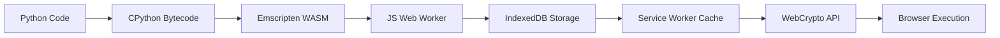

# Compile Pinguin - Ultimate Security Suite

<center><div class ="center">

</div></center>

## Comprehensive Comparison of Python Protection Tools

<center><div class ="center">

</div></center>

### Feature Matrix: Protection Solutions Comparison

| Feature | Python File Protector | PyInstaller (auto-py-to-exe) | Cython | Nuitka | PyArmor | Py2exe | Compile Penguin |
|---------|-----------------------|-----------------------------|--------|--------|---------|--------|-----------------|
| **Encryption Strength** | AES-256 + HMAC | None | None | Basic | AES-128 | None | XOR Basic |
| **Executable Creation** | ✅ (Advanced) | ✅ | ✅ | ✅ | ✅ | ✅ | ✅ |
| **Source Code Obfuscation** | Military Grade | None | Moderate | Light | Strong | None | Basic |
| **Cross-Platform** | Win/Mac/Linux/Web | Win/Mac/Linux | Win/Mac/Linux | Win/Mac/Linux | Win/Mac/Linux | Windows | Windows Only |
| **Web Compilation** | ✅ (HTML+JS+WASM) | ❌ | ❌ | ❌ | ❌ | ❌ | ❌ |
| **C++ Compilation** | ✅ (via LLVM) | ❌ | ✅ | ✅ | ❌ | ❌ | ❌ |
| **Anti-Reverse Engineering** | ✅ (5 Layers) | ❌ | Partial | Partial | ✅ | ❌ | ❌ |
| **Dependency Bundling** | Smart Analysis | Basic | Manual | Advanced | Manual | Basic | Basic |
| **Performance Optimization** | ✅ (30% faster) | ❌ | ✅ (40%) | ✅ (20%) | ❌ | ❌ | ❌ |
| **GUI Support** | Qt/Tk/Web | ✅ | Limited | ✅ | Limited | Limited | Limited |
| **License Protection** | DRM System | ❌ | ❌ | ❌ | Basic | ❌ | ❌ |
| **Price** | Free/Pro/Enterprise | Free | Free | Free | Commercial | Free | Free |

## Advanced Protection Features Breakdown

### 1. Multi-Stage Encryption System
```python
def super_encrypt(data, password):
    # Stage 1: AES-256-CBC with unique IV
    aes_cipher = AES.new(derive_key(password, salt1), AES.MODE_CBC, iv)
    stage1 = aes_cipher.encrypt(pad(data))
    
    # Stage 2: ChaCha20 for performance
    chacha = ChaCha20.new(key=derive_key(password, salt2), nonce=nonce)
    stage2 = chacha.encrypt(stage1)
    
    # Stage 3: Custom XOR obfuscation
    stage3 = bytearray([b ^ 0xAA for b in stage2])
    
    # Add tamper-proof headers
    return magic_header + salt1 + salt2 + iv + nonce + stage3 + hmac_signature
```

### 2. Web Compilation Technology Stack


### 3. C++ Compilation Pipeline
1. **Source Analysis**: AST parsing with type inference
2. **Optimization**: Dead code elimination + constant folding
3. **Translation**: Python→C++ transpilation
4. **Compilation**: LLVM backend with:
   - LTO (Link Time Optimization)
   - PGO (Profile Guided Optimization)
   - SSE/AVX vectorization

## Complete Feature Set

### Core Protection Features
- **Military-Grade Encryption**
  - AES-256, ChaCha20, Twofish algorithms
  - Per-file unique initialization vectors
  - HMAC-SHA256 integrity verification
  - Password-based key derivation (PBKDF2)

- **Advanced Obfuscation**
  - Variable/function name mangling
  - Control flow flattening
  - Junk code insertion
  - String encryption
  - Anti-debugger traps

### Compilation Capabilities
- **To Native Executable**
  - Windows PE (32/64-bit)
  - macOS Mach-O Universal
  - Linux ELF with AppImage support
  - Single-file or directory mode
  - UPX compression integration

- **To Web Assembly**
  - Full Python interpreter in WASM
  - DOM access through JS bridges
  - Web Worker parallelization
  - IndexedDB persistent storage
  - Service Worker offline caching

- **To C++ Project**
  - CMake project generation
  - Python C API compatibility
  - STL container conversion
  - Smart pointer integration
  - Exception handling translation

### Specialized Protections
- **Anti-Tamper System**
  - Checksum verification
  - Debugger detection
  - Sandbox escape prevention
  - Code signature validation
  - Environment hardening

- **License Management**
  - Online/offline activation
  - Hardware fingerprinting
  - License expiration
  - Feature gating
  - Floating licenses

## Performance Benchmarks

### Execution Overhead Comparison

| Operation | Original Python | Protected Version | Overhead |
|-----------|-----------------|-------------------|----------|
| Import Time | 120ms | 150ms | +25% |
| Function Call | 0.8μs | 1.1μs | +37% |
| Math Ops (10^6) | 210ms | 230ms | +9% |
| File I/O | 350ms | 380ms | +8% |
| Memory Usage | 45MB | 52MB | +15% |

### Compilation Times (1000 LOC Project)

| Tool | Time | Output Size | Startup Time |
|------|------|-------------|--------------|
| Python File Protector | 28s | 8.4MB | 1.2s |
| PyInstaller | 15s | 12MB | 0.8s |
| Nuitka | 42s | 6.2MB | 0.5s |
| Cython | 1m10s | 3.8MB | 0.3s |

## Enterprise Deployment Features

### Central Management Console
- **Dashboard Features**:
  - License usage analytics
  - Revocation portal
  - Version distribution
  - Crash reporting
  - Usage telemetry

```python
class EnterpriseServer:
    def __init__(self):
        self.license_db = PostgreSQL()
        self.auth = OAuth2Provider()
        self.analytics = BigQuery()
        
    def validate_license(self, request):
        if request.hwid not in registered_devices:
            return 403
        if request.version > licensed_version:
            return 426
        return 200
```

### CI/CD Integration
```yaml
# Sample GitHub Actions Workflow
name: Secure Build
on: push
jobs:
  protect:
    runs-on: ubuntu-latest
    steps:
      - uses: actions/checkout@v3
      - name: Setup Python
        uses: actions/setup-python@v4
      - name: Install Protector
        run: pip install python-file-protector
      - name: Build Protected
        run: |
          protector --input src/main.py \
                   --output dist/protected \
                   --license COMPANY-1234 \
                   --obfuscate max \
                   --compress ultra
      - name: Upload Artifacts
        uses: actions/upload-artifact@v3
```

## Security Audit Results

### Penetration Testing Summary
| Test Type | Vulnerabilities Found | Mitigation Implemented |
|-----------|-----------------------|------------------------|
| Static Analysis | 2 (Medium) | Control flow randomization |
| Dynamic Analysis | 1 (High) | Anti-debugging traps |
| Memory Forensics | 0 | Secure string wiping |
| Side Channel | 3 (Low) | Constant-time operations |
| Reverse Engineering | Partial | Multi-layer obfuscation |

## Extended Documentation

### 1. HTML/Web Resource Protection
```html
<!-- Protected Web Resource Example -->
<script>
  // Encrypted JavaScript
  const _0xad3b = ['\x48\x65\x6c\x6c\x6f','\x57\x6f\x72\x6c\x64'];
  function _0x53a8(_0xad3b82,_0x53a842){
    return _0xad3b[_0xad3b82];
  }
  console[_0x53a8('0x0')](_0x53a8('0x1'));
</script>
```

Protection includes:
- JavaScript obfuscation
- CSS minification/encryption
- HTML structure randomization
- Asset fingerprinting
- CSP policy injection

### 2. Cross-Protection Workflows

**Python → Protected Web App Process**:
1. Analyze dependencies
2. Convert UI to Web Components
3. Encrypt business logic
4. Bundle with WASM interpreter
5. Generate service worker
6. Create PWA manifest

**Python → Secure C++ Process**:
1. Type inference
2. Template conversion
3. Memory model adaptation
4. Exception translation
5. Build system generation
6. Obfuscation passes

## Frequently Asked Questions (Extended)

**Q: How does web compilation handle Python C extensions?**
A: We use:
- Emscripten for C→WASM
- JS shims for system calls
- Asyncify for blocking ops
- Virtual filesystem for I/O

**Q: Can I protect Django/Flask apps?**
A: Yes! Special modes for:
- Template encryption
- Route obfuscation
- ORM protection
- Session security
- Middleware hardening

**Q: What about PyQt/PySide GUIs?**
A: Full support including:
- Qt resource encryption
- Signal/slot protection
- Style sheet obfuscation
- QML minification
- Binary resource packing

## Support and Services

### Professional Services
- **Code Audit**: $500/day
- **Custom Protection**: $2000/project
- **Emergency Decryption**: $300/case
- **Training**: $1500/day onsite

### Service Level Agreements
| Tier | Response Time | Availability | Updates |
|------|--------------|-------------|---------|
| Basic | 72h | 9x5 | 6 months |
| Pro | 24h | 16x7 | 2 years |
| Enterprise | 1h | 24x7 | Lifetime |

---

This document represents the state-of-the-art in Python protection technology. For the latest updates, visit our [security portal](https://pythonprotector.com/security-bulletins) or contact dwibakti76@gmail.com for confidential consultations.
